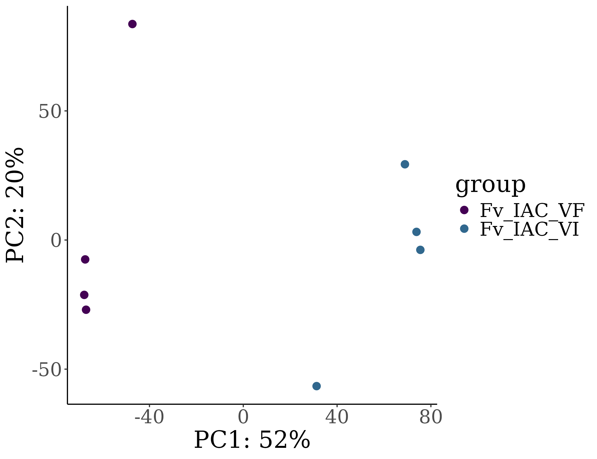
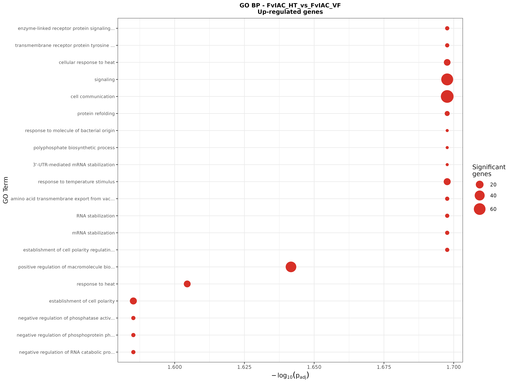
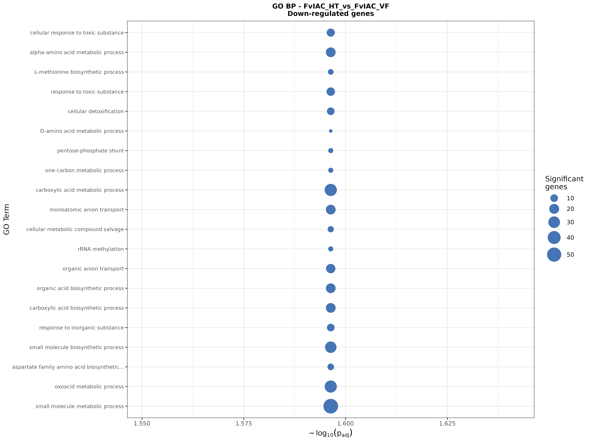
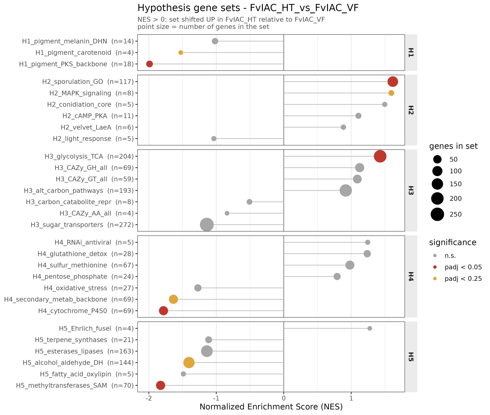

# RNAseq analysis of *Fusarium verticillioides*

## Overview

This repository accompanies the study of *Fusarium verticillioides* and its interaction with a mycovirus.

Two strains of the same fungal background were compared in axenic culture. The DESeq2 `group`
factor has exactly two levels:

| `group` level | Mycovirus |
|---|---|
| `FvIAC-VF` | absent |
| `FvIAC-HT` | present |


**Contrast direction (important).** All differential expression is reported for the contrast

```r
results(dds, contrast = c("group", "FvIAC-HT", "FvIAC-VF"))   # numerator, denominator
```

Therefore:

- **Upregulated** = expressed **more** in `FvIAC-HT` than in `FvIAC-VF`.
- **Downregulated** = expressed **less** in `FvIAC-HT` than in `FvIAC-VF`.
- Positive log2FoldChange / positive NES = higher in HT strain.


## Palette of colours

`#E64B35FF` for `FvIAC-HT`

`#4DBBD5FF` for `FvIAC-VF`

Other colours that can be used: `#00A087FF`, `#3C5488FF`, `#F39B7FFF`

## RNAseq Workflow Description

| sample | fastq_1 | fastq_2 | group | strandedness | rep |
|---|---|---|---|---|---|
| Fv_IAC_VF_1 | /dados01/samuel/israel/BCL/1_Marcio_L1-ds.6e0b458ce2384e8cb21357ec3add4b18/1_Marcio_S25_L001_R1_001.fastq.gz | /dados01/samuel/israel/BCL/1_Marcio_L1-ds.6e0b458ce2384e8cb21357ec3add4b18/1_Marcio_S25_L001_R2_001.fastq.gz | FvIAC-VF | auto | 1 |
| Fv_IAC_VF_2 | /dados01/samuel/israel/BCL/2_Marcio_L1-ds.a5021cd52e334b1783ff3660db27a95b/2_Marcio_S26_L001_R1_001.fastq.gz | /dados01/samuel/israel/BCL/2_Marcio_L1-ds.a5021cd52e334b1783ff3660db27a95b/2_Marcio_S26_L001_R2_001.fastq.gz | FvIAC-VF | auto | 2 |
| Fv_IAC_VF_3 | /dados01/samuel/israel/BCL/3_Marcio_L2-ds.aba760a0b0c64830ba843995dc4ca4d8/3_Marcio_S55_L002_R1_001.fastq.gz | /dados01/samuel/israel/BCL/3_Marcio_L2-ds.aba760a0b0c64830ba843995dc4ca4d8/3_Marcio_S55_L002_R2_001.fastq.gz | FvIAC-VF | auto | 3 |
| Fv_IAC_VF_4 | /dados01/samuel/israel/BCL/4_Marcio_L2-ds.226c81a392dd4e33b68b4f663e8fed38/4_Marcio_S56_L002_R1_001.fastq.gz | /dados01/samuel/israel/BCL/4_Marcio_L2-ds.226c81a392dd4e33b68b4f663e8fed38/4_Marcio_S56_L002_R2_001.fastq.gz | FvIAC-VF | auto | 4 |
| Fv_IAC_VI_1 | /dados01/samuel/israel/BCL/5_Marcio_L1-ds.15178dbbc2574ba8b4897a507ee4ddd7/5_Marcio_S27_L001_R1_001.fastq.gz | /dados01/samuel/israel/BCL/5_Marcio_L1-ds.15178dbbc2574ba8b4897a507ee4ddd7/5_Marcio_S27_L001_R2_001.fastq.gz | FvIAC-HT | auto | 1 |
| Fv_IAC_VI_2 | /dados01/samuel/israel/BCL/6_Marcio_L1-ds.10e33f2626ce4884b5b266f3026a9d90/6_Marcio_S28_L001_R1_001.fastq.gz | /dados01/samuel/israel/BCL/6_Marcio_L1-ds.10e33f2626ce4884b5b266f3026a9d90/6_Marcio_S28_L001_R2_001.fastq.gz | FvIAC-HT | auto | 2 |
| Fv_IAC_VI_3 | /dados01/samuel/israel/BCL/7_Marcio_L2-ds.f194cc72af0f4b14aa2ddc55e6c36c28/7_Marcio_S57_L002_R1_001.fastq.gz | /dados01/samuel/israel/BCL/7_Marcio_L2-ds.f194cc72af0f4b14aa2ddc55e6c36c28/7_Marcio_S57_L002_R2_001.fastq.gz | FvIAC-HT | auto | 3 |
| Fv_IAC_VI_4 | /dados01/samuel/israel/BCL/8_Marcio_L2-ds.2677da67026447f7b907796488a58de7/8_Marcio_S58_L002_R1_001.fastq.gz | /dados01/samuel/israel/BCL/8_Marcio_L2-ds.2677da67026447f7b907796488a58de7/8_Marcio_S58_L002_R2_001.fastq.gz | FvIAC-HT | auto | 4 |

**Design:** 2 groups × **4 biological replicates** = 8 libraries, paired-end

### 1. **References**

- `Genome Assembly`: `/dados04/jorge/rnaseq_diatraea/reference_genomes/fusarium_verticillioides/GCF_000149555.1_ASM14955v1_genomic.fa.gz`
- `Proteins`: `/dados04/jorge/rnaseq_diatraea/reference_genomes/fusarium_verticillioides/GCF_000149555.1_ASM14955v1_protein.faa`
- `GTF`: `/dados04/jorge/rnaseq_diatraea/reference_genomes/fusarium_verticillioides/GCF_000149555.1_ASM14955v1_genomic.gtf.gz`

### 2. **Protein Annotation**

We used `emapper-2.1.3` from `EggNOG v5.0` to obtain annotations (including GO terms) for the proteins
of the genome, based on orthology relationships.

- Results: `/dados04/jorge/rnaseq_diatraea/reference_genomes/fusarium_verticillioides/eggnog_anot/eggnog_anot.emapper.annotations`

### 3. **RNAseq processing**

We used a `Nextflow v25.04.7` pipeline, `rnaseq (v3.12.0)` from nf-core
(https://nf-co.re/rnaseq/3.12.0), to preprocess, align and quantify the RNAseq data.

We used the default method of `rnaseq (v3.12.0)`, which uses the `STAR` aligner and `Salmon` to
quantify transcript abundance.

The full preprocessing and alignment report can be found at
`/dados04/jorge/israel_rnaseq/rnaseq/run01/multiqc/star_salmon/multiqc_report.html`

- Generated reads: 449.2M
- Reads aligned to reference: 272.2M (60.6%)

### 4. **Exploratory Analysis**

Transcript-level quantifications produced by Salmon were imported into DESeq2 and aggregated to gene
level. Counts were transformed with `vst` (variance stabilizing transformation) for exploratory
visualisation.

Filtering and significance parameters:

| Parameter | Value |
|---|---|
| `min_count` | 5 |
| `min_samples` | 5 |
| `lfc_threshold` | 1 |
| `padj_threshold` | 0.05 |

A gene was retained if it had ≥ 5 counts in ≥ 5 of the 8 libraries.

- Initial genes: 16,290
- Genes after filtering: 9,330
- Genes removed: 6,960 (42.7%)

- Principal component analysis (on vst-transformed counts):



### 5. **Differential Expression Analysis (DEA)**

We conducted a differential expression analysis (DEA) on the contrast below, filtering for
p-adj (FDR) < 0.05 and |log2 fold change| > 1.

**Contrast:** `FvIAC_HT_vs_FvIAC_VF` — numerator `FvIAC-HT`, denominator `FvIAC-VF`.

Interpretation of the contrast:

- **Upregulated** genes in `FvIAC_HT_vs_FvIAC_VF` are expressed **more** in `FvIAC-HT`
  (virus-harbouring) than in `FvIAC-VF` (virus-free).
- **Downregulated** genes in `FvIAC_HT_vs_FvIAC_VF` are expressed **less** in `FvIAC-HT`
  than in `FvIAC-VF`.

- DESeq2 results: `/dados04/jorge/israel_rnaseq/rnaseq/run01/star_salmon/deseq2_qc`

#### Summary of DEG counts (|LFC| > 1, padj < 0.05)

| Contrast | Description | Upregulated | Downregulated | Total DEGs |
|---|---|---:|---:|---:|
| FvIAC_HT_vs_FvIAC_VF | `FvIAC-HT` vs `FvIAC-VF` | 931 | 1,336 | 2,267 |

### 6. **Functional Enrichment Analysis (ORA)**

To gain insight into the functions and processes represented by the sets of up- and down-regulated
genes, we carried out over-representation analysis (ORA) of Gene Ontology terms.

- **GO:** `topGO` R package (v2.58.0), p-value < 0.05, corrected for multiple testing with the
  Benjamini–Hochberg (FDR) procedure. Background: all 9,330 genes retained after filtering.

- Up-regulated genes:



  Table: `rnaseq/run01/star_salmon/deseq2_qc/FvIAC_HT_vs_FvIAC_VF/GO_enrichment/GO_BP_upregulated.csv`

- Down-regulated genes:



  Table: `rnaseq/run01/star_salmon/deseq2_qc/FvIAC_HT_vs_FvIAC_VF/GO_enrichment/GO_BP_downregulated.csv`

Full enrichment results on the server:
`/dados04/jorge/israel_rnaseq/rnaseq/run01/star_salmon/deseq2_qc/FvIAC_HT_vs_FvIAC_VF/GO_enrichment`

### 7. **Gene Set Enrichment Analysis (GSEA)**

#### 7.1 Rationale

The ORA in Section 6 operates on the *thresholded* DEG lists (|LFC| > 1, padj < 0.05), which discards
~76% of the tested genes and treats a gene with LFC = 0.98 identically to one with LFC = 0.01. In an
exploratory design with few biological replicates, a biologically meaningful response frequently
appears as a **coordinated, modest shift of many genes in a pathway** rather than as a handful of
large-fold-change outliers — a pattern that ORA is structurally unable to detect.

We therefore complemented the ORA with a hypothesis-driven Gene Set Enrichment Analysis, which uses
the **complete ranking of all tested genes** and applies no significance cutoff. Gene sets were not
taken from a generic database: they were **constructed a priori** to represent the specific phenotypic
hypotheses raised by the accompanying experiments (H1–H5 below), so that each hypothesis maps onto an
explicit, testable transcriptional signature.

#### 7.2 Hypotheses

Phenotypic hypotheses arising from the accompanying experiments:

| # | Hypothesis | Tested by GSEA |
|---|---|---|
| **H1** | The mycovirus alters the **colour** and morphology of fungal colonies. | Colour only |
| **H2** | The mycovirus interferes with the fungus's capacity for **spore production**. | Yes |
| **H3** | The mycovirus modifies the fungus's ability to use different **carbon sources**. | Yes |
| **H4** | The mycovirus modulates the **metabolic pathways** of the fungal host. | Yes |
| **H5** | The mycovirus influences the profile of **volatile organic compounds** emitted by the fungus. | Yes |
| **H6** | The mycovirus affects the fungus's ability to cause **disease in the plant host**. | No |
| **H7** | The mycovirus alters the **tritrophic interaction** among fungus, plant and insect via chemical signals. | No |

**H6 and H7 were not tested.** Both require readouts absent from an axenic, fungus-only
transcriptome — an infected plant host and an insect, respectively. Expression of virulence-associated
genes in culture is not evidence of altered *in planta* disease, and a three-way interaction cannot be
evidenced from a single-organism dataset. Both are deferred to dedicated experimental designs
(*in planta* infection RNAseq; multi-organism assays).

**The morphology component of H1 was likewise excluded**, as colony morphology has no compact,
well-defined transcriptional gene set; only the pigmentation component was retained.

#### 7.3 Gene set construction

Gene sets were built from the eggNOG-mapper v2.1.3 annotation (Section 2) using the `Preferred_name`,
`Description`, `PFAMs`, `EC`, `KEGG_ko`, `KEGG_Pathway`, `GOs` and `CAZy` fields.

**Identifier resolution.** eggNOG annotates protein accessions (`XP_*`), whereas DESeq2 reports gene
identifiers (`FVEG_*`). Proteins were mapped to genes via the `protein_id` / `gene_id` attributes of
the CDS features in the reference GTF. Genes with multiple protein isoforms were collapsed to a single
record by taking the union of their annotation terms.

**Statistical universe.** The background for all tests was restricted to genes that were both
(i) retained after low-count filtering **and** assigned a non-NA adjusted p-value by DESeq2 — i.e.
genes that were actually *eligible* to be called differentially expressed — and (ii) present in the
eggNOG annotation. Genes removed by DESeq2 independent filtering were excluded; including them would
inflate the apparent enrichment of every set.

**Curated sets (n = 27).**

| Hypothesis | Gene sets | Primary annotation evidence |
|---|---|---|
| **H1** — pigmentation | bikaverin, fusarubin, carotenoid, DHN-melanin, PKS backbone | `Preferred_name`, `Description`, PFAM (`ketoacyl-synt`), EC |
| **H2** — sporulation / conidiation | conidiation core, velvet/LaeA complex, sporulation GO, MAPK cascade, cAMP–PKA, light response | `Preferred_name`, PFAM (`Velvet`), GO (GO:0030435, GO:0048315, GO:0043938, GO:0075307, GO:1903666) |
| **H3** — carbon source utilization | CAZy classes (GH, GT, PL, CE, AA), sugar transporters, carbon catabolite repression, glycolysis/TCA, alternative carbon pathways | `CAZy`, PFAM (`Sugar_tr`, `MFS_1`), KEGG (ko00010/20/30/40/51/52/500/520/620/630/640/650) |
| **H4** — host metabolic pathways | secondary-metabolite backbone, cytochrome P450, oxidative stress, glutathione detoxification, pentose-phosphate, sulfur/methionine, RNAi machinery | KEGG (ko00030, ko00270, ko00480, ko00920), PFAM, EC |
| **H5** — volatile organic compounds | terpene synthases, alcohol/aldehyde dehydrogenases, Ehrlich (fusel) pathway, oxylipin / fatty-acid oxidation, esterases & lipases, SAM-methyltransferases | PFAM (`Terpene_synth`, `ADH_N`, `Aldedh`, `Lipoxygenase`), EC (1.1.1.1, 1.2.1.3) |

**Data-driven sets.** In addition, all KEGG pathways (`ko#####`) and all CAZy families with ≥ 3 genes
in the universe were tested automatically, providing an unbiased complement to the
hypothesis-directed sets.

#### 7.4 Gene set sizes and annotation coverage

Set sizes were computed **within the statistical universe** (8,742 genes) before any testing. Sets
with fewer than `minSize = 3` genes could not be tested and are reported as **not testable** rather
than as negative results.

**H1 — pigmentation**

| Gene set | Genes | Status |
|---|---:|---|
| `H1_pigment_bikaverin` | 0 |  not testable |
| `H1_pigment_fusarubin` | 0 |  not testable |
| `H1_pigment_carotenoid` | 4 | tested |
| `H1_pigment_melanin_DHN` | 14 | tested |
| `H1_pigment_PKS_backbone` | 18 | tested |

**H2 — sporulation / conidiation**

| Gene set | Genes | Status |
|---|---:|---|
| `H2_conidiation_core` | 5 | tested |
| `H2_light_response` | 5 | tested |
| `H2_velvet_LaeA` | 6 | tested |
| `H2_MAPK_signaling` | 8 | tested |
| `H2_cAMP_PKA` | 11 | tested |
| `H2_sporulation_GO` | 117 | tested |

**H3 — carbon source utilization**

| Gene set | Genes | Status |
|---|---:|---|
| `H3_CAZy_PL_all` | 1 | not testable |
| `H3_CAZy_CE_all` | 2 |  not testable |
| `H3_CAZy_AA_all` | 4 | tested |
| `H3_carbon_catabolite_repr` | 8 | tested |
| `H3_CAZy_GT_all` | 59 | tested |
| `H3_CAZy_GH_all` | 69 | tested |
| `H3_alt_carbon_pathways` | 193 | tested |
| `H3_glycolysis_TCA` | 204 | tested |
| `H3_sugar_transporters` | 272 | tested |

**H4 — host metabolic pathways**

| Gene set | Genes | Status |
|---|---:|---|
| `H4_RNAi_antiviral` | 5 | tested |
| `H4_pentose_phosphate` | 24 | tested |
| `H4_oxidative_stress` | 27 | tested |
| `H4_glutathione_detox` | 28 | tested |
| `H4_sulfur_methionine` | 67 | tested |
| `H4_secondary_metab_backbone` | 69 | tested |
| `H4_cytochrome_P450` | 69 | tested |

**H5 — volatile organic compounds**

| Gene set | Genes | Status |
|---|---:|---|
| `H5_Ehrlich_fusel` | 4 | tested |
| `H5_fatty_acid_oxylipin` | 5 | tested |
| `H5_terpene_synthases` | 21 | tested |
| `H5_methyltransferases_SAM` | 70 | tested |
| `H5_alcohol_aldehyde_DH` | 144 | tested |
| `H5_esterases_lipases` | 163 | tested |

**Summary**

| Hypothesis | Sets defined | Tested | Not testable |
|---|---:|---:|---:|
| H1 — pigmentation | 5 | 3 | 2 |
| H2 — sporulation | 6 | 6 | 0 |
| H3 — carbon sources | 9 | 7 | 2 |
| H4 — metabolism | 7 | 7 | 0 |
| H5 — volatiles | 6 | 6 | 0 |
| **Total** | **33** | **29** | **4** |

Full table: `geneset_sizes.csv`



#### 7.5 Statistical testing

**GSEA.** Enrichment was computed with the `fgsea` R package (`fgseaMultilevel`). All genes in the
universe were ranked by the **DESeq2 Wald statistic** (`stat` = log2FoldChange / lfcSE). The Wald
statistic was preferred over raw log2FC because, with few replicates, log2FC alone is dominated by
low-expression genes with large standard errors.

**Statistical universe.** The background for all tests was restricted to genes that were both
(i) assigned complete DESeq2 statistics (9,174 genes; Section 5) and (ii) present in the eggNOG
annotation, giving a final universe of **8,742 genes**. Within this universe, 900 of the 931
up-regulated and 1,269 of the 1,336 down-regulated DEGs are annotated and were used for the
complementary ORA.

| Stage | Genes |
|---|---:|
| Genes in the annotation (GTF) | 16,290 |
| Retained after low-count filtering | 9,330 |
| With complete DESeq2 statistics | 9,174 |
| **Statistical universe (tested & eggNOG-annotated)** | **8,742** |
| — of which up-regulated | 900 |
| — of which down-regulated | 1,269 |

**Curated sets.** 33 sets were defined a priori across the five hypotheses:


| Output | Content |
|---|---|
| `fgsea_all_sets.csv` | NES, p, padj, set size, leading edge — all sets |
| `fisher_all_sets.csv` | Fisher's exact test, all sets × direction (up / down / any) |
| `fisher_significant.csv` | Fisher hits at padj < 0.05 |
| `DEG_hits_per_hypothesis_set.csv` | Gene-level table: LFC, lfcSE, stat, padj, eggNOG annotation |
| `geneset_sizes.csv` | Annotation-coverage diagnostic |
| `hypothesis_summary.csv` | H1–H5 overview (best set, NES, padj per hypothesis) |
| `fgsea_hypothesis_sets.png` | NES per set, faceted by hypothesis; **point size = number of genes in the set** |

Output directory:
`/dados04/jorge/israel_rnaseq/rnaseq/run01/star_salmon/deseq2_qc/FvIAC_HT_vs_FvIAC_VF/hypothesis_genesets`

Software: R v4.5.3, `fgsea` v1.36.2, `dplyr_1.2.0`, `tidyr_1.3.2`, `readr_2.2.0`, `ggplot2_4.0.2`


